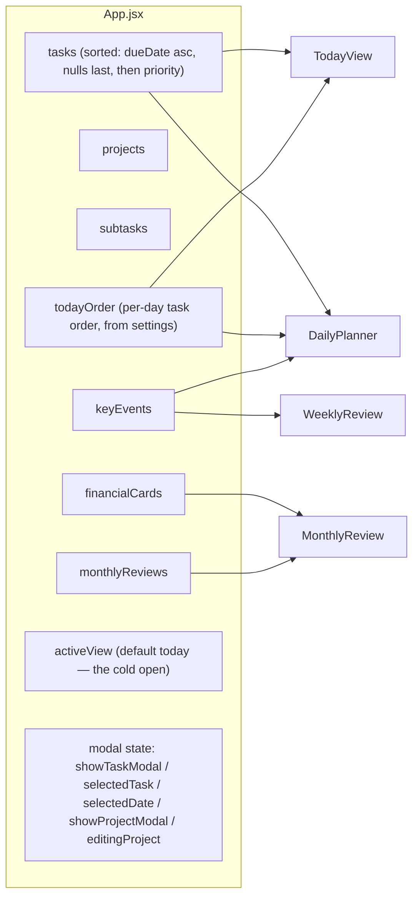
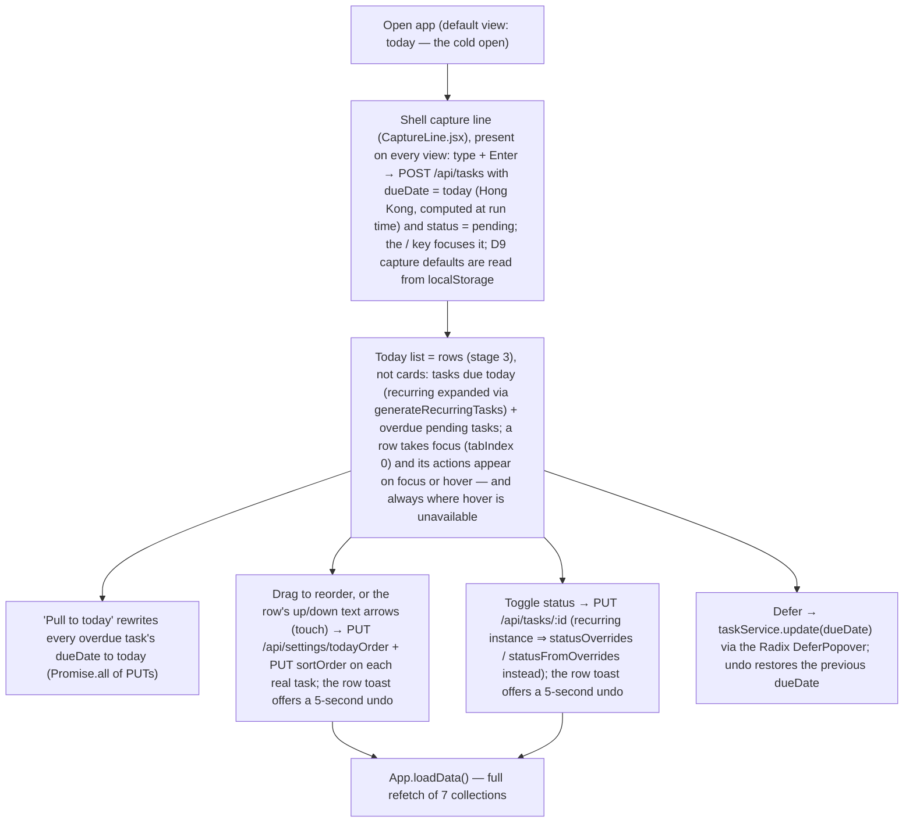
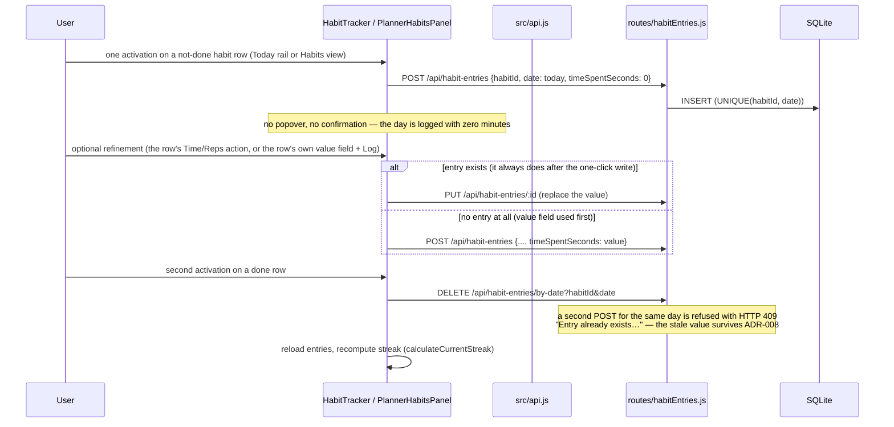
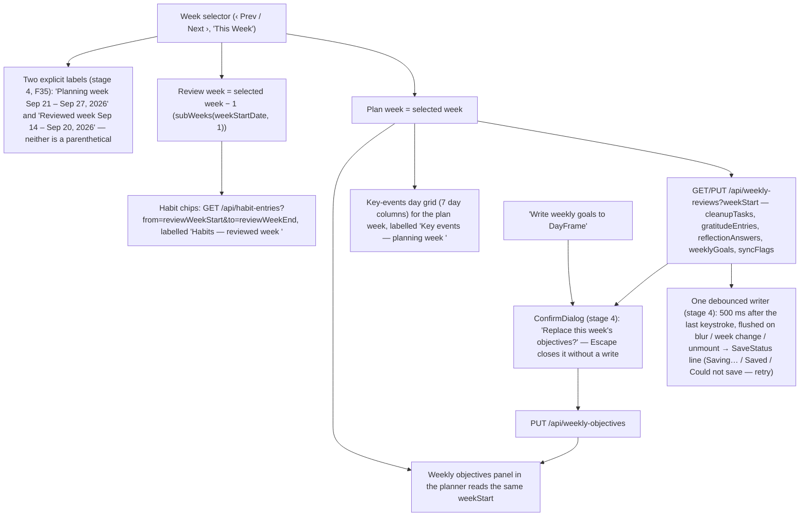
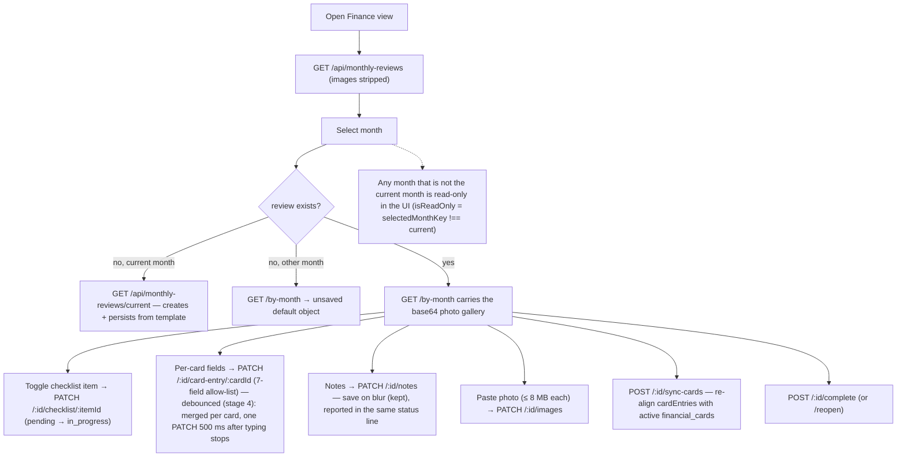
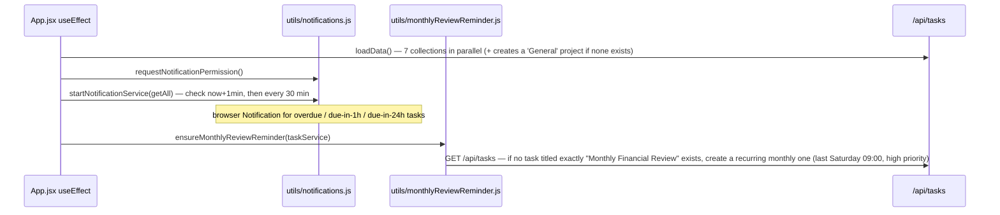

# DayFrame — Architecture

Owner: `df-lead` · Last updated: 2026-09-26 (v1.7 — close-out by card `t_55c01442`: the UI-direction ADR is cited as **ADR-013** (it was renumbered on `master` on 2026-09-26 when the habits-normalization ADR claimed ADR-012 - every "ADR-012" in the change's own artifacts and cards means this entry), §7's pre-existing-failure note is corrected (the `MiniWeekBar` expectation was reconciled in stage 4 and the suite is green), and §1/§2/§3/§4 are re-checked against the code as shipped; v1.6 — §2 the keyboard layer, §3 `paletteOpen`, §4.6 the keyboard layer's handler map and its rules, revised by card `t_4925715f`, stage 5 of `ui-modernization-calm-canvas`: one frozen key map in `src/components/keyboard.js` + `useKeyboardLayer.js`, visible focus on every list row with 0 surviving outline suppressions, and the droppable `CommandPalette.jsx`; §4's heading drops "five" because §4.6 is not a flow; v1.5 — §2 the dialog shell + the status line, §3 the focused day, §4.3 both week labels and debounced saves, §4.4 the finance save path, revised by card `t_63c2607b`, stage 4 of `ui-modernization-calm-canvas`: `AppDialog`/`ConfirmDialog`/`PromptDialog` replace every `window.confirm/alert/prompt`, one reserved save-status line per persisting surface, the two dead day-select controls wired; v1.4 — §2 Today's children + the habit rail, §4.1 the day loop and §4.2 the habit write path revised by card `t_7fd24929`, stage 3 of `ui-modernization-calm-canvas`: rows instead of cards, focus-reachable row actions, one 5-second undo, one-click habit logging; v1.3 — §1 styling line added by card `t_65d60fc8`, stage 1 of `ui-modernization-calm-canvas`: the CSS-custom-property token layer is the styling substrate; v1.2 — §2/§7 revised by card `t_aa4715eb`, stage 0: the four dead components and their stylesheets are deleted; every other statement still re-verified against the code at `master` `526f3b3`)

DayFrame is Anderson's personal task / habit / review app. Local-first, single user, no authentication.
Everything runs on one Windows machine; the browser is the only client.

## 1. Runtime shape

| Layer | Tech | Dev | Prod |
|---|---|---|---|
| UI | **React 19** (`react@^19.2.0`, `react-dom@^19.2.0` — `package.json:33-34`) + **Vite 8 beta** (`vite@^8.0.0-beta.13`, `package.json:52`) | `npm run dev:client` → `http://localhost:5173` | `npm run build` (`vite build`) → `dist/`, served by Express |
| API | Node + Express 5 (`express@^5.2.1`) | `npm run dev:server` → `http://localhost:3001` | `npm run start` = `NODE_ENV=production node server/index.js` |
| DB | SQLite (better-sqlite3) | `data/app.db` (gitignored, never committed) | same file |
| Styling | CSS custom properties — `src/styles/tokens.css` (ADR-013), imported first in `src/main.jsx` and consumed by `index.css`, `App.css` and the component stylesheets; both mode sets declared, dark not shipped; no CSS framework | Vite HMR | bundled by `vite build` into `dist/assets/*.css` |

`npm run dev` = both processes (concurrently). `npm run test:run` = vitest one-shot · `npm run lint` = eslint · `npm run build` = production build.

- The client talks to the API through `src/api.js` only: the single `fetch` call site is `request()` (`src/api.js:1-12`), which is mounted on 16 service objects. No component calls `fetch` (verified by grep over `src/`).
- Dev: Vite proxies `/api` → `:3001` (`vite.config.js:7-14`). Prod: Express serves `dist/` and falls back to `index.html` for non-API paths (`server/index.js:46-52`). `cors` is a declared dependency (`package.json:29`) but **no CORS middleware is mounted** — the app is same-origin in both modes.
- **The server imports two client modules**: `server/routes/monthlyReviews.js:3-4` imports `src/utils/lastSaturday.js` and `src/utils/checklistTemplate.js`. Those two files are shared client/server code — a change there changes server behaviour.
- **Styling is a CSS-custom-property token layer**, not a framework: `src/styles/tokens.css` (ADR-013) is imported **first** in `src/main.jsx` and declares colour, the eight-row type ladder, space, radius, shadow and motion, plus a second (dark) set that is declared but unreachable. `src/index.css` is the single owner of the globals — reset, `:root`/`body` ground, font family (system stack, no network request), the one `:focus-visible` recipe and the one `prefers-reduced-motion` block — and `src/App.css` carries app-shell classes only. Component stylesheets consume the tokens; the ones already written as `var(--token, fallback)` adopt them the moment a token name exists, so the layer's reach is wider than the files it edits. 0 new dependencies.

Anderson is in Hong Kong (GMT+8). **A "week" starts Monday. Dates are never hardcoded** — they are computed at run time.

## 2. Component hierarchy (as actually imported)

```mermaid
graph TD
    App["App.jsx — root: all shared state, activeView, modals"]

    App --> SB["TopStrip.jsx — 52px shell strip: Today · Week · Habits · Review + More (Finance · Projects · Backup · Notifications)"]
    App --> Cap["CaptureLine.jsx — the shell's one capture line, on every view"]
    App --> Today["TodayView.jsx"]
    App --> Planner["DailyPlanner.jsx"]
    App --> Habits["HabitTracker.jsx"]
    App --> Projects["ProjectsView.jsx"]
    App --> Review["WeeklyReview.jsx"]
    App --> Finance["MonthlyReview.jsx"]
    App --> Modals["App-level modals: TaskModal · ProjectModal — now Dialog-owned (stage 4)"]
    App --> Palette["CommandPalette.jsx — command palette (the droppable slice)"]
    App --> Kbd["keyboard.js + useKeyboardLayer.js — the frozen key map, one document handler"]
    App --> Dlg["AppDialog.jsx — the one Radix dialog shell (stage 4): AppDialog · ConfirmDialog · PromptDialog, with the focus trap, Escape dismissal and focus return"]

    Today --> Timeline["DailyTimeline.jsx"]
    Today --> PHPanel["PlannerHabitsPanel.jsx — today's habits (collapsed rail) + DailyWorkflow"]
    Today --> Defer["DeferPopover.jsx"]
    Today --> Undo["UndoToast.jsx — one 5-second undo for complete / defer / reorder"]
    Today --> RowAct["TooltipButton.jsx — tooltipped icon actions (move up/down, edit)"]

    Planner --> Mini["MiniWeekBar.jsx — week nav (prev · Today · next) + 7 day buttons"]
    Planner --> DayCol["DayColumn.jsx (×7)"]
    Planner --> Backlog["BacklogSidebar.jsx"]
    Planner --> Yearly["YearlyGoals.jsx"]
    Planner --> WObj["WeeklyObjectives.jsx — weekly objectives + key-events day columns"]

    Habits --> Heatmap["HabitHeatmap.jsx"]
    Habits --> HModal["HabitModal.jsx — Dialog-owned"]
    Heatmap --> TP["TimePopover.jsx — Radix popover"]
    Heatmap --> RP["RepsPopover.jsx — Radix popover"]
    PHPanel --> TP
    TP --> Pop["RadixPopover.jsx — the one popover shell (Radix anchor + portal + viewport clamping)"]
    RP --> Pop
    Defer --> Pop
    PHPanel --> Workflow["DailyWorkflow.jsx"]

    Finance --> Cards["FinancialCards.jsx"]
    Yearly --> Rich["RichTextEditor.jsx"]
    Modals --> Rich

    Review --> Save["SaveStatus.jsx — the one reserved save-status line (stage 4)"]
    Finance --> Save
    WObj --> Save

    Review --> Dlg
    Finance --> Dlg
    Projects --> Dlg
    Modals --> Dlg
    HModal --> Dlg
    Rich --> Dlg

    Habits --> API["src/api.js — 16 service objects, one per resource"]
    WObj --> API
    API -.-> Server["Express server/index.js"]
    Server --> Routers["server/routes/*.js — 16 routers"]
    Routers --> DB[("SQLite data/app.db")]
```

Notes verified against the import graph:

- `PlannerHabitsPanel`, `DailyTimeline` and `DeferPopover` are children of **TodayView** (`src/components/TodayView.jsx:3-5`) — not of the planner. `TimePopover` / `RepsPopover` are shared by `HabitTracker`, `HabitHeatmap` and `PlannerHabitsPanel`.
- `DailyPlanner` also owns `BacklogSidebar`, `YearlyGoals` and `WeeklyObjectives` (`src/components/DailyPlanner.jsx:4-8`). `BacklogSidebar` is **not** in ProjectsView.
- `WeeklyReview.jsx` imports no local component: it renders its own three sections, its own habit chips and its own key-events day grid (`WeeklyReview.jsx:597-844`). `WeeklyObjectives.jsx` (the planner panel) is a *different* key-events UI that also carries the weekly objectives (`WeeklyObjectives.jsx:189, 328-336`).
- The planner view is also wrapped by an App-level toolbar (New Task / New Project / Total-Done-Pending stats) rendered in `App.jsx:346-375`.
- **Deleted in stage 0 of `ui-modernization-calm-canvas`** (ADR-013; card `t_aa4715eb`, branch `feat/ui-s0-dead-code`): `Calendar.jsx`/`.css`, `DayPanel.jsx`/`.css`, `OutstandingTasks.jsx`/`.css`, `DailyShutdown.jsx`/`.css` — four components with 0 importers, 1,828 CSS lines (`Calendar.css` 916, `DayPanel.css` 486, `OutstandingTasks.css` 353, `DailyShutdown.css` 73). `DailyShutdown` was **deleted, not revived** (`design.md` §4/D8): the `daily_notes` rows, the table and `GET/PUT /api/daily-notes` are untouched, so no data was removed, and the audit's F42 (a daily close-out ritual) stays an **open item** for a later change once Today's rows have landed. The `vi.mock('../components/DailyShutdown', …)` that was its last remaining reference went with it. `package.json` was **not** touched — `@fullcalendar/*` is now an unused declared dependency, and removing it is its own decision.
- **The shell, stage 2 of `ui-modernization-calm-canvas`** (ADR-013; card `t_5d2bcf9d`, branch `feat/ui-s2-shell`): `Sidebar.jsx`/`.css` were renamed to `TopStrip.jsx`/`.css` (`git mv`) and now render one ~52px top strip — the app name plus the period as the page title, four text destinations (Today · Week · Habits · Review) and a Radix `dropdown-menu` "More" overflow holding Finance / Projects / Backup / Notifications. All six views stay reachable at 1440 / 768 / 420px, which closes F16 (the rail was `display: none` below 768px). `CaptureLine.jsx`/`.css` is mounted **once**, by `App.jsx` in `.app-chrome` directly under the strip, so quick capture is a shell element: `TodayView.jsx` no longer renders an input of its own. `src/components/captureDefaults.js` owns the client-only D9 preference (`localStorage['dayframe.captureDefaults']`) — no API, schema or settings-row change.
- **Today + habits, stage 3 of `ui-modernization-calm-canvas`** (ADR-013; card `t_7fd24929`, branch `feat/ui-s3-today-habits`): the Today list, the Week view's day columns and the backlog render **rows** (one line per entry, hairline separated, title at body size, metadata in one muted size) instead of cards — no card fill, no left colour stripe, no shadow. Row actions (move up/down, defer, edit) are revealed on **focus** as well as hover and are always visible where `@media (hover: none)` matches, so nothing is hover-only (audit F10); the up/down arrows remain as the touch reorder controls. Completing, deferring or reordering a row offers **one** 5-second undo (`UndoToast.jsx`, the pattern of `HabitTracker.css:215-242` — the habit-delete toast is untouched). The three hand-rolled popovers (`TimePopover`, `RepsPopover`, `DeferPopover`) and the heat-map popover now render through `RadixPopover.jsx`, a thin `@radix-ui/react-popover` shell that owns the anchor, the portal and the viewport clamping; icon-only buttons use `TooltipButton.jsx` (`@radix-ui/react-tooltip`, `aria-label` kept as the accessible name). The Today habit rail is collapsed to one "N of M done" line until it is activated (view-local state) and one activation on a not-done row writes the day with zero minutes.
- **Week / review / finance, stage 4 of `ui-modernization-calm-canvas`** (ADR-013; card `t_63c2607b`, branch `feat/ui-s4-week-review-finance`): three pieces, all presentation.
  1. **The dialogs are Radix-owned.** `src/components/AppDialog.jsx` is the one dialog shell (`@radix-ui/react-dialog`) and exports `AppDialog` (the shell), `ConfirmDialog` (the `window.confirm`/`window.alert` replacement — `cancelLabel={null}` renders the single-action alert form) and `PromptDialog` (the `window.prompt` replacement). It owns the focus trap, Escape dismissal and focus return; focus returns through `onCloseAutoFocus` rather than a `Dialog.Trigger`, because several call sites are re-rendered or unmounted by the very mutation they guard. `Dialog.Content` is rendered **inside** `Dialog.Overlay` so the app's existing `.modal-overlay`/`.modal-content` centring (`.modal-overlay { display:flex }`) keeps working. Call sites: `App.jsx` (task delete + the backup-failure notice), `ProjectsView.jsx` (project delete), `ProjectModal.jsx` (project delete), `WeeklyReview.jsx` (the objectives-replacement confirm and the "nothing to sync" alert) and `RichTextEditor.jsx` (the link-URL prompt). `TaskModal`, `HabitModal` and `ProjectModal` render their shells through `AppDialog` too, which is what gives them Escape dismissal. There are **0** `window.confirm|alert|prompt` call sites under `src/` (design.md §3 D7).
  2. **One debounced writer and one reserved status line per persisting surface** (`src/components/useDebouncedSave.js` + `SaveStatus.jsx`, design.md §8 D12): 500 ms after the last keystroke, flushed on blur and on navigating away (and on unmount), with `Saving…` / `Saved` (fades after ~2 s) / `Could not save — retry` in a reserved `role="status" aria-live="polite"` line. Typing is debounced; discrete actions (a checkbox, an add, a remove) still write immediately; the finance notes textarea keeps its save-on-blur behaviour, now reported in the same line. No write fires per keystroke on any surface.
  3. **Both weeks are named** (F35 / ADR-005) and the two dead day-select controls work (F20). See §3 and §4.3.
- **The keyboard layer, stage 5 of `ui-modernization-calm-canvas`** (ADR-013; card `t_4925715f`, branch `feat/ui-s5-keyboard`): three pieces of presentation, no behaviour moved.
  1. **One key map, two owners.** `src/components/keyboard.js` (plain `.js` — a component file may not export helpers, `react-refresh/only-export-components`) holds the frozen map, the "am I allowed to fire" test (`isTypingContext`, `isOverlayOpen`) and the two DOM operations the layer needs (`moveRowFocus`, `handleRowKeyDown`). `src/components/useKeyboardLayer.js` registers the app-level half **once**, from `App.jsx`. See §4.6 for the division of ownership.
  2. **Visible focus everywhere.** `src/index.css` keeps the single global `:focus-visible` recipe on the three focus tokens; stage 5 removed the last three sites that suppressed the outline without a replacement (`DailyWorkflow.css`'s add-step field and `YearlyGoals.css`'s textarea + add field), so **0 `outline: none` declarations remain under `src/**/*.css`**. Every list row is its own focus target (`tabIndex={0}` + `data-kbd-row`) and each list container carries `data-kbd-list`, which is what scopes `j`/`k`; the app's single pre-existing `tabIndex` (`MonthlyReview.jsx`'s photo paste zone) is untouched.
  3. **The command palette is the droppable last slice.** `src/components/CommandPalette.jsx`/`.css` + its one mount in `App.jsx` + the `Ctrl/⌘ + K` entry in `useKeyboardLayer.js`. Deleting those three leaves everything else working (proved by removal — see the card comment). Its footer renders the key map, which is the in-app discoverability affordance `design.md` §6 asks for. It adds no router, no `activeView` value and no app state beyond the boolean that opens it.

## 3. State ownership

- `App.jsx` owns the cross-view state and reloads everything with one `loadData()` (`App.jsx:47-78`, 7 parallel service calls) after almost every mutation. Views keep their own local state for their period/document.
- `activeView` defaults to **`today`** — Today is the cold open (`App.jsx:41`, stage 2 of `ui-modernization-calm-canvas`). There is no router and no new app-level view state: `TopStrip` just sets this one string, exactly as the rail did.
- `CaptureLine` keeps its own input text and its D9 defaults in local state and re-reads `localStorage['dayframe.captureDefaults']` at capture time, so nothing about capture lives in `App.jsx` beyond passing `projects` down and calling `loadData` when a task lands.
- `HabitTracker` receives **no props** (`App.jsx:397-399`): it fetches habits and entries itself. `WeeklyReview` and `MonthlyReview` receive only the slice they need.
- `todayOrder` is an ordered array of task keys stored as a generic settings row (`App.jsx:202-211`, `settingsService`).
- **Stage 4 adds no app-level state.** Two pieces of state exist and both are view-local: `DailyPlanner`'s `focusedDay` (F20 — the day button in the week bar and a day column's own header both set it; it drives the column emphasis, the `.mini-week-day[aria-pressed]` marker and the horizontal scroll, and it is cleared whenever the week moves) and the save status, which lives inside `useDebouncedSave` in the surface that persists (WeeklyReview, MonthlyReview, WeeklyObjectives) and is rendered by `SaveStatus`. `App.jsx` gained only two dialog flags — `pendingTaskDelete` (the id awaiting confirmation) and `noticeDialog` (the backup-failure notice) — neither of which is shared with a view.
- **Stage 5 adds exactly one piece of app-level state**: `App.jsx`'s `paletteOpen` boolean, which is what the droppable command palette needs to open and close. The keyboard layer itself owns no state — it reads the DOM (`[data-kbd-row]` / `[data-kbd-list]`), and the only module-level value is the `g` chord's armed flag in `keyboard.js`. The row keys drive each surface's own callbacks, so `x`/`t` move the same core state (`todayOrder` + `sortOrder`, the recurring status override, `dueDate`) that the pointer path moves.

## 4. The main user flows

### 4.1 Daily loop — quick capture → schedule → complete

Evidence: `src/components/CaptureLine.jsx` (capture, the `/` key, the D9 defaults; `src/components/captureDefaults.js` owns the localStorage key), `src/components/TodayView.jsx:60-103` (today/overdue lists, `mergeOrder`), `:85-89` (pull-to-today), `src/App.jsx:152-184` (recurring status override logic), `src/App.jsx:202-211` (todayOrder), `src/utils/recurrence.js:102-143` (instance generation). Stage 3 of `ui-modernization-calm-canvas` restyled this surface without moving any of that logic: the row markup, the focus-revealed `.tv-row-actions`, the `UndoToast` and the Radix `RadixPopover` shell are presentation only. **Stage 4** wired the Week view's two dead day-select controls (`DailyPlanner.handleSelectDay`, `DayColumn`'s header): activating a day in the week bar or a column's own header sets a view-local focused day that emphasises that column and scrolls it into view — no app state, no route (`design.md` §3 D7/D12 scope; F20).

### 4.2 Habit logging (one click, and the 409 trap)

Evidence: `src/components/HabitTracker.jsx` (`handleToggleToday` = one click, `handleLogRowValue` = the per-row refinement, one value field per row), `src/components/PlannerHabitsPanel.jsx` (`handleToggleToday` / `handleRefineToday`, collapsed rail), `server/routes/habitEntries.js:31-49` (409 on conflict), `:52-63` (PUT), `:66-70` (delete by date), `src/utils/habits.js:39-85` (streaks). **The 409 trap is unchanged and still the reason the refinement PUTs instead of POSTing**: a second POST for the same day does not update — it answers 409 and the stale value survives (ADR-008). `count` stays inert (ADR-011).

### 4.3 Weekly review + planning (one selector, two weeks)

Evidence: `src/components/WeeklyReview.jsx:292-327` (default = last Monday; `reviewWeekStart = subWeeks(weekStartDate, 1)`), `:343-345` (doc + reviewed-week habit fetch), `:512-528` (goals → `weekly_objectives` bridge, with an existing-objectives warning), `src/components/WeeklyObjectives.jsx:221-239`. **Stage 4** rewrote the write path without moving the period model: the same `weeklyReviewService.upsert(weekStart, doc)` payload is now handed to `useDebouncedSave` instead of firing per keystroke, week navigation awaits `flush()` before it moves the window, and the replacement warning is `ConfirmDialog` rather than `window.confirm`. Verified on the branch with the selected week at W = Sep 21–27: the habit fetch went out as `?from=2026-09-14&to=2026-09-20` (= W−1) while the document stayed on `?weekStart=2026-09-21`.

### 4.4 Monthly finance review

Evidence: `server/routes/monthlyReviews.js:100-115` (list strips `images`; `/current` get-or-creates), `:118-130` (`/by-month`), `:190-232` (checklist / card-entry), `:271-288` (`images`), `:294-331` (`sync-cards`), `src/components/MonthlyReview.jsx:51` (`MAX_PHOTO_BYTES = 8 * 1024 * 1024`), `:218-219` (`isReadOnly`), `src/utils/checklistTemplate.js:11-57` (the 20-item, 5-section template). **Stage 4 changed nothing in substance here**: `isReadOnly = selectedMonthKey !== currentMonthKey` still gates every write, the ≤8 MB cap and the read-only thumbnail + lightbox rules are untouched, and the paste zone still disappears on a non-current month. What changed is only *when* a typed card field is written — the per-card patches are merged into one object and sent 500 ms after typing stops (one PATCH per card, not one per keystroke) — plus the reserved status line in the header.

### 4.5 App bootstrap side effects (fires on every mount)

Evidence: `src/App.jsx:80-95` (bootstrap), `:67-74` (default project), `src/utils/notifications.js:17-68`, `src/utils/monthlyReviewReminder.js:16-55`.
**Why this matters:** the reminder bootstrap explains recurring "Monthly Financial Review" duplicates — it is idempotent by exact title only, so any renamed/duplicated task re-triggers creation.

### 4.6 The keyboard layer (stage 5) — where each handler is registered

One frozen map (`design.md` §6 D10), four registration points, and no key handled twice:

| Key | Registered in | Scope |
|---|---|---|
| `/` | `CaptureLine.jsx` (a document `keydown`) | Focuses the shell's capture input; needs that component's own ref, so it stayed where stage 2 put it |
| `j` / `k` | `useKeyboardLayer.js` (a document `keydown`, mounted once by `App.jsx`) | Moves focus between `[data-kbd-row]` elements inside the focused row's `[data-kbd-list]` container, or the first list on the screen when nothing is focused |
| `x` / `t` | each row's own `onKeyDown` (`handleRowKeyDown` from `keyboard.js`) | Toggles completion / defers to tomorrow **through the surface's existing callbacks**, so the keyboard drives the same handlers as the pointer |
| `u` | `UndoToast.jsx` (a document `keydown`, alive only while the toast is) | Runs the toast's own undo callback — one undo mechanism, and it works after the acted-on row has left the list |
| `g` then `t/w/h/r/f/p` | `useKeyboardLayer.js` | Switches the one `activeView` string; the chord is armed for 1.5 s and disarms on the next keystroke |
| `Escape` | every overlay's own dismissable layer (Radix dialog/popover/menu, the two lightboxes) | Closes the open overlay; the layer deliberately adds nothing here |
| `Ctrl/⌘ + K` | `useKeyboardLayer.js` | Opens/closes `CommandPalette.jsx` |

**Rules that make the layer safe.** A handler fires only when `isTypingContext(document.activeElement)` is false — an `<input>`, `<textarea>`, `<select>`, a `contenteditable`/`.ProseMirror` editor, or anything inside an open `[role="dialog"]`/`[aria-modal]`; `Escape` and `Ctrl/⌘ + K` are the two deliberate exceptions (a chord is not a character anyone types). No handler consumes Tab, and `preventDefault()` is called only on a key the handler actually acted on. While the `g` chord is armed the row handlers stand down (`keyboard.js`'s module-level `isGotoArmed()`), so `g` then `t` means "go to Today" rather than "defer this row".

**What the layer does not do.** It adds no router, no seventh `activeView` value and no app-level state except `App.jsx`'s `paletteOpen` boolean. Row state is the surfaces' own: `TodayView` supplies `x`/`t` from the handlers its own buttons use (so completing still offers the stage-3 undo), `DayColumn` supplies `x` on every row and `t` only where the write is safe (a non-recurring task dated today or earlier — writing `dueDate` on a recurring source would move the whole series), and `BacklogSidebar` supplies both from the props `DailyPlanner` already passes. The `t` key writes `dueDate` = tomorrow computed at run time (CONV-003); it never hardcodes a date.

## 5. Period model (the app's hard part)

| Domain | Key | Window rule |
|---|---|---|
| Tasks | `dueDate` (date) | overdue = `status='pending'` && dueDate < today && not recurring (`TodayView.jsx:76-83`) |
| Daily planner / notes | `date` | one doc per day (`daily_notes UNIQUE(date)`); no `?date=` ⇒ latest 30 rows |
| Habits | `habit_entries(habitId, date)` | one entry per habit per day (`UNIQUE(habitId, date)`) |
| Weekly review / objectives | `weekStart` (+ `mode` on the parked branch only) | Monday-start week, HK time; no `?weekStart=` ⇒ latest 12 rows |
| Monthly finance review | `monthKey` (`YYYY-MM`) | one doc per month; only the current month is editable |
| Yearly goals | `year` | one row per year; `?year=` is mandatory |

**Weekly review week semantics (ADR-005):** one week selector serves both "review the week that just ended" and "plan next week". The document/goals/sync and the key-events grid belong to the *selected* (plan) week; the **habit summary panel reads `weekStart − 1`** (`WeeklyReview.jsx:323-327, 345`).

## 6. Storage conventions

- JSON blobs live in TEXT columns with a `DEFAULT '[]'` / `'{}'` and are parsed in the route layer (`parseTask` in `server/routes/tasks.js:7-18`, `parseHabit` in `habits.js:6-13`, `parseNote`, etc.). Parsed fields: `descriptionImages`, `assignedTo`, `recurrencePattern`, `statusOverrides`, `statusFromOverrides`, `frequency`, `objectives`, `cleanupTasks`, `gratitudeEntries`, `reflectionAnswers`, `weeklyGoals`, `syncFlags`, `rolledOverTaskIds`, `checklist`, `cardEntries`, `images`, `goals`.
- **Base64 images live in the DB** (ADR-003): `yearly_goals.images`, `tasks.descriptionImages`, `monthly_reviews.images`. `express.json({ limit: '50mb' })` exists for exactly this (`server/index.js:25`). `GET /api/monthly-reviews` strips `images` (`monthlyReviews.js:29-33, 102`); detail endpoints carry it.
- Migrations are **idempotent and add-only**: `try { db.exec('ALTER TABLE … ADD COLUMN …') } catch {}` inside `server/db.js`. Existing rows must always survive.
- **The DB in use can be ahead of the code.** See `DATA_MODEL.md` §5 — `CREATE TABLE IF NOT EXISTS` never re-shapes an existing table, so a clone's schema ≠ the running DB's schema.

## 7. Known constraints & traps

- Single user, no auth, no multi-tenancy — "who did what" is not modelled (see DATA_MODEL §3).
- Vite dev server proxies `/api` to `:3001`; the API must be running or every view renders empty (`loadData` swallows the error into `console.error`, `App.jsx:75-77`).
- **Test and lint counts must be scoped, and the scoping changes the numbers.** Nested checkouts under the gitignored `.worktrees/` are collected by an unscoped run from the repo root: re-measured 2026-09-24 on stage 0 of `ui-modernization-calm-canvas` (four nested checkouts parked there), `npm run test:run` = **138 files / 1,635 tests / 5 failed** — one copy of the `MiniWeekBar` failure per nested checkout — and `npm run lint` (`eslint .`) = **669 problems**. The counts scale with how many checkouts are parked under `.worktrees/`; they are a collection artefact, never a regression.
- **The scoped baseline (stage 0, card `t_aa4715eb`):** `npx vitest run --exclude='**/.worktrees/**'` = **27 files / 326 tests / 1 failed** in a worktree of the app's own tracked source, `npx eslint src` = **8 problems (8 errors, 0 warnings)**, `npx vite build` = success. The single failure **in that baseline** was the then-pre-existing `MiniWeekBar.test.jsx:38-39` (it expected 9 buttons, the render yields 10) - **reconciled in stage 4** of `ui-modernization-calm-canvas`, the stage that repainted the component (`t_63c2607b`): the test now asserts the bar's real control set (7 day buttons + `‹` + `Today` + `Next ›` = **10**), and the suite is **fully green at the end of the change: 30 files / 383 tests / 0 failed** (close-out, 2026-09-26, branch `docs/ui-modernization-archive`). The main working tree reports **28 files / 331 tests** for the same code because it additionally carries the untracked `src/__tests__/wrModeStorage.test.jsx` (POL-003 — never touch it), and 30 files once the two files under `not relevant/CodeNomad/` (gitignored, not part of the app) are counted with their collection errors.
- Habit **count tracking is inert on master**: the UI sends `trackType` and `count` but neither is persisted (`DATA_MODEL.md` §6). Anything reading `entry.count` reads `undefined`.
- The repo may carry **uncommitted work from another worker**; always `git status` first and never stage someone else's hunks (DECISION_LOG POL-002, POL-003).
- **The GitHub repo `lung123w/dayframe` is public** (`api.github.com/repos/lung123w/dayframe` → `"private": false`) while `server/routes/financialCards.js:6-16` seeds real account numbers into source. Treat every commit as public.

## 8. How to update this document

Rule B of the dev-context policy: before a task is marked Done, update this file whenever a component, state-owner, period rule or storage convention changed (including the Mermaid diagrams). Cite files, not intentions.
