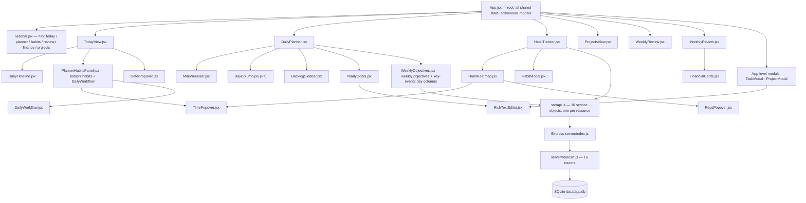
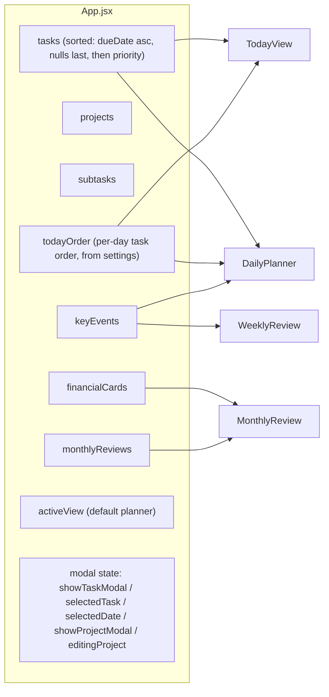
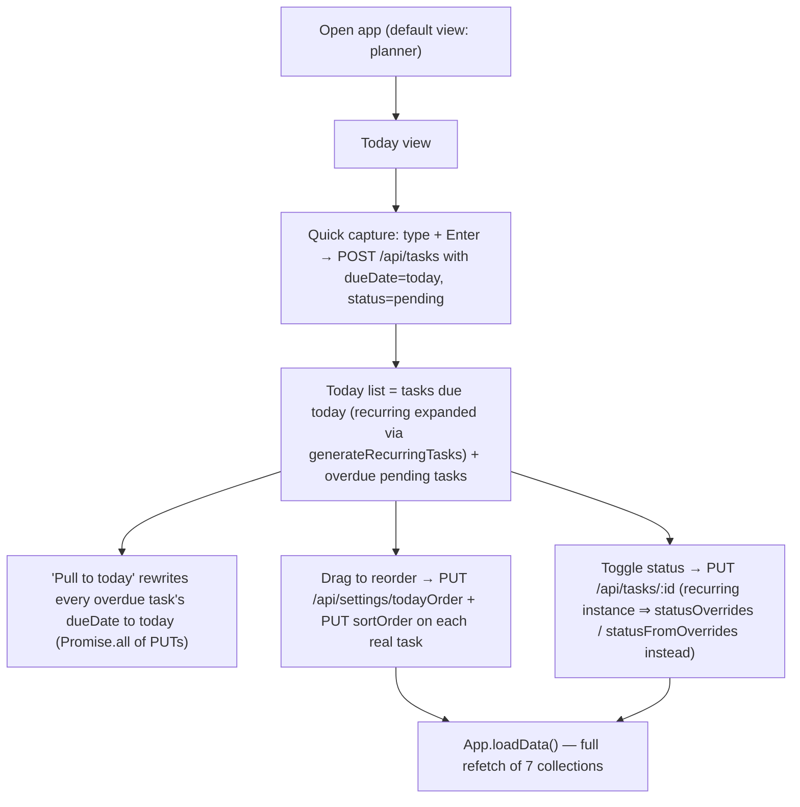
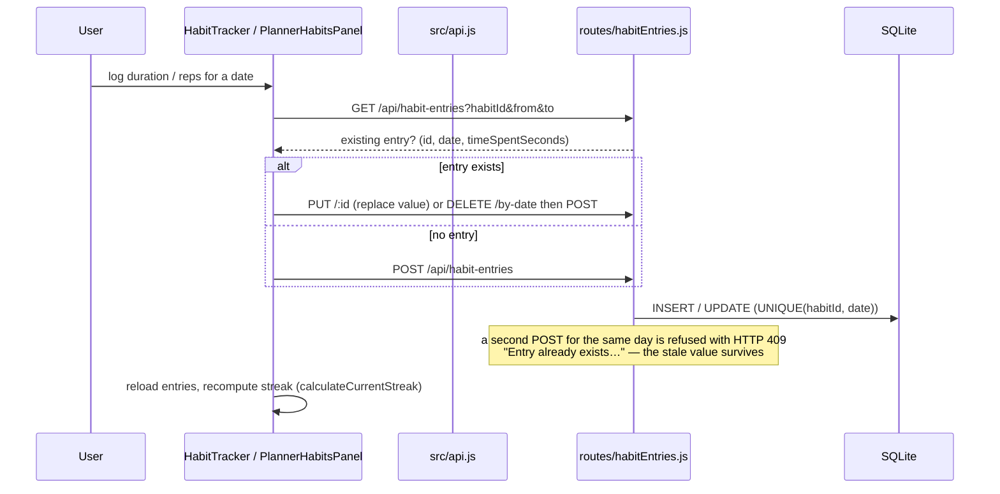
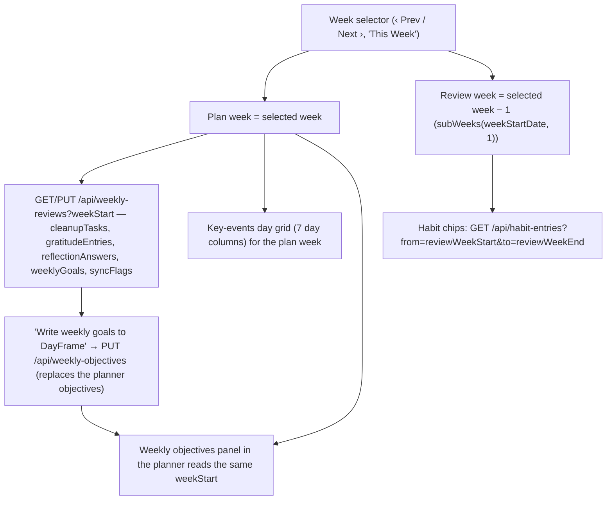
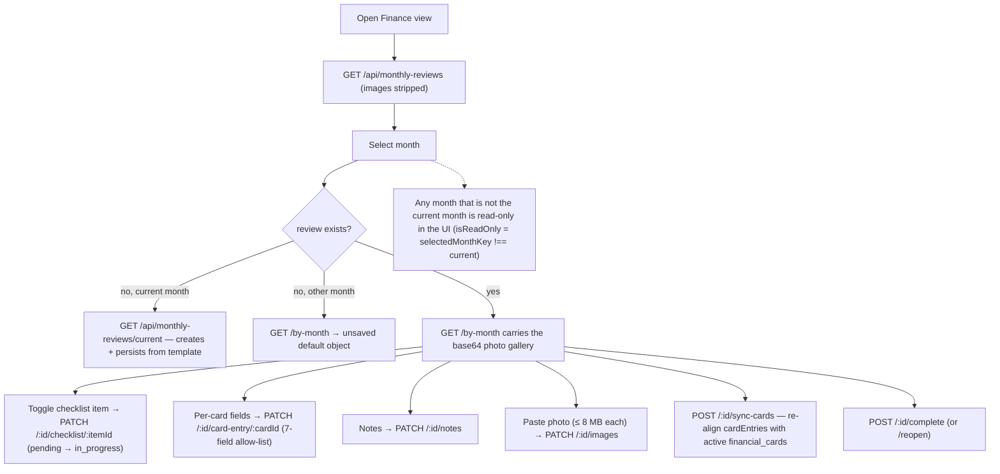
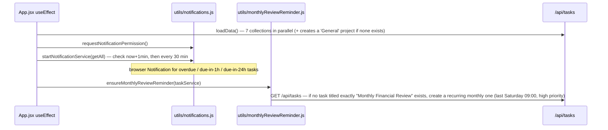

# DayFrame — Architecture

Owner: `df-lead` · Last updated: 2026-09-20 (v1.1 — every statement re-verified against the code at `master` `526f3b3`)

DayFrame is Anderson's personal task / habit / review app. Local-first, single user, no authentication.
Everything runs on one Windows machine; the browser is the only client.

## 1. Runtime shape

| Layer | Tech | Dev | Prod |
|---|---|---|---|
| UI | **React 19** (`react@^19.2.0`, `react-dom@^19.2.0` — `package.json:33-34`) + **Vite 8 beta** (`vite@^8.0.0-beta.13`, `package.json:52`) | `npm run dev:client` → `http://localhost:5173` | `npm run build` (`vite build`) → `dist/`, served by Express |
| API | Node + Express 5 (`express@^5.2.1`) | `npm run dev:server` → `http://localhost:3001` | `npm run start` = `NODE_ENV=production node server/index.js` |
| DB | SQLite (better-sqlite3) | `data/app.db` (gitignored, never committed) | same file |

`npm run dev` = both processes (concurrently). `npm run test:run` = vitest one-shot · `npm run lint` = eslint · `npm run build` = production build.

- The client talks to the API through `src/api.js` only: the single `fetch` call site is `request()` (`src/api.js:1-12`), which is mounted on 16 service objects. No component calls `fetch` (verified by grep over `src/`).
- Dev: Vite proxies `/api` → `:3001` (`vite.config.js:7-14`). Prod: Express serves `dist/` and falls back to `index.html` for non-API paths (`server/index.js:46-52`). `cors` is a declared dependency (`package.json:29`) but **no CORS middleware is mounted** — the app is same-origin in both modes.
- **The server imports two client modules**: `server/routes/monthlyReviews.js:3-4` imports `src/utils/lastSaturday.js` and `src/utils/checklistTemplate.js`. Those two files are shared client/server code — a change there changes server behaviour.

Anderson is in Hong Kong (GMT+8). **A "week" starts Monday. Dates are never hardcoded** — they are computed at run time.

## 2. Component hierarchy (as actually imported)

Notes verified against the import graph:

- `PlannerHabitsPanel`, `DailyTimeline` and `DeferPopover` are children of **TodayView** (`src/components/TodayView.jsx:3-5`) — not of the planner. `TimePopover` / `RepsPopover` are shared by `HabitTracker`, `HabitHeatmap` and `PlannerHabitsPanel`.
- `DailyPlanner` also owns `BacklogSidebar`, `YearlyGoals` and `WeeklyObjectives` (`src/components/DailyPlanner.jsx:4-8`). `BacklogSidebar` is **not** in ProjectsView.
- `WeeklyReview.jsx` imports no local component: it renders its own three sections, its own habit chips and its own key-events day grid (`WeeklyReview.jsx:597-844`). `WeeklyObjectives.jsx` (the planner panel) is a *different* key-events UI that also carries the weekly objectives (`WeeklyObjectives.jsx:189, 328-336`).
- The planner view is also wrapped by an App-level toolbar (New Task / New Project / Total-Done-Pending stats) rendered in `App.jsx:346-375`.
- **Dead code (imported by nothing):** `Calendar.jsx`, `DailyShutdown.jsx`, `DayPanel.jsx`, `OutstandingTasks.jsx` (verified: 0 importers; `DailyShutdown` survives only as a `vi.mock` in `src/__tests__/DailyPlanner.weekNavigation.test.jsx:11`). Do not treat them as live surfaces.

## 3. State ownership

- `App.jsx` owns the cross-view state and reloads everything with one `loadData()` (`App.jsx:47-78`, 7 parallel service calls) after almost every mutation. Views keep their own local state for their period/document.
- `activeView` defaults to **`planner`**, not `today` (`App.jsx:41`). There is no router — the Sidebar just sets this one string.
- `HabitTracker` receives **no props** (`App.jsx:397-399`): it fetches habits and entries itself. `WeeklyReview` and `MonthlyReview` receive only the slice they need.
- `todayOrder` is an ordered array of task keys stored as a generic settings row (`App.jsx:202-211`, `settingsService`).

## 4. The five main user flows

### 4.1 Daily loop — quick capture → schedule → complete

Evidence: `src/components/TodayView.jsx:39-49` (capture), `:60-103` (today/overdue lists, `mergeOrder`), `:85-89` (pull-to-today), `src/App.jsx:152-184` (recurring status override logic), `src/App.jsx:202-211` (todayOrder), `src/utils/recurrence.js:102-143` (instance generation).

### 4.2 Habit logging (the write path with a trap)

Evidence: `src/components/HabitTracker.jsx:80-97` (toggle/delete path), `server/routes/habitEntries.js:31-49` (409 on conflict), `:52-63` (PUT), `:66-70` (delete by date), `src/utils/habits.js:39-85` (streaks).

### 4.3 Weekly review + planning (one selector, two weeks)

Evidence: `src/components/WeeklyReview.jsx:292-327` (default = last Monday; `reviewWeekStart = subWeeks(weekStartDate, 1)`), `:343-345` (doc + reviewed-week habit fetch), `:512-528` (goals → `weekly_objectives` bridge, with an existing-objectives warning), `src/components/WeeklyObjectives.jsx:221-239`.

### 4.4 Monthly finance review

Evidence: `server/routes/monthlyReviews.js:100-115` (list strips `images`; `/current` get-or-creates), `:118-130` (`/by-month`), `:190-232` (checklist / card-entry), `:271-288` (`images`), `:294-331` (`sync-cards`), `src/components/MonthlyReview.jsx:51` (`MAX_PHOTO_BYTES = 8 * 1024 * 1024`), `:218-219` (`isReadOnly`), `src/utils/checklistTemplate.js:11-57` (the 20-item, 5-section template).

### 4.5 App bootstrap side effects (fires on every mount)

Evidence: `src/App.jsx:80-95` (bootstrap), `:67-74` (default project), `src/utils/notifications.js:17-68`, `src/utils/monthlyReviewReminder.js:16-55`.
**Why this matters:** the reminder bootstrap explains recurring "Monthly Financial Review" duplicates — it is idempotent by exact title only, so any renamed/duplicated task re-triggers creation.

## 5. Period model (the app's hard part)

| Domain | Key | Window rule |
|---|---|---|
| Tasks | `dueDate` (date) | overdue = `status='pending'` && dueDate < today && not recurring (`TodayView.jsx:76-83`) |
| Daily planner / notes | `date` | one doc per day (`daily_notes UNIQUE(date)`); no `?date=` ⇒ latest 30 rows |
| Habits | `habit_entries(habitId, date)` | one entry per habit per day (`UNIQUE(habitId, date)`) |
| Weekly review / objectives | `weekStart` (+ `mode` on the parked branch only) | Monday-start week, HK time; no `?weekStart=` ⇒ latest 12 rows |
| Monthly finance review | `monthKey` (`YYYY-MM`) | one doc per month; only the current month is editable |
| Yearly goals | `year` | one row per year; `?year=` is mandatory |

**Weekly review week semantics (ADR-005):** one week selector serves both "review the week that just ended" and "plan next week". The document/goals/sync and the key-events grid belong to the *selected* (plan) week; the **habit summary panel reads `weekStart − 1`** (`WeeklyReview.jsx:323-327, 345`).

## 6. Storage conventions

- JSON blobs live in TEXT columns with a `DEFAULT '[]'` / `'{}'` and are parsed in the route layer (`parseTask` in `server/routes/tasks.js:7-18`, `parseHabit` in `habits.js:6-13`, `parseNote`, etc.). Parsed fields: `descriptionImages`, `assignedTo`, `recurrencePattern`, `statusOverrides`, `statusFromOverrides`, `frequency`, `objectives`, `cleanupTasks`, `gratitudeEntries`, `reflectionAnswers`, `weeklyGoals`, `syncFlags`, `rolledOverTaskIds`, `checklist`, `cardEntries`, `images`, `goals`.
- **Base64 images live in the DB** (ADR-003): `yearly_goals.images`, `tasks.descriptionImages`, `monthly_reviews.images`. `express.json({ limit: '50mb' })` exists for exactly this (`server/index.js:25`). `GET /api/monthly-reviews` strips `images` (`monthlyReviews.js:29-33, 102`); detail endpoints carry it.
- Migrations are **idempotent and add-only**: `try { db.exec('ALTER TABLE … ADD COLUMN …') } catch {}` inside `server/db.js`. Existing rows must always survive.
- **The DB in use can be ahead of the code.** See `DATA_MODEL.md` §5 — `CREATE TABLE IF NOT EXISTS` never re-shapes an existing table, so a clone's schema ≠ the running DB's schema.

## 7. Known constraints & traps

- Single user, no auth, no multi-tenancy — "who did what" is not modelled (see DATA_MODEL §3).
- Vite dev server proxies `/api` to `:3001`; the API must be running or every view renders empty (`loadData` swallows the error into `console.error`, `App.jsx:75-77`).
- `npx vitest run` = **30 test files / 331 tests**; from the app there are 28 files under `src/__tests__/`, of which **1 test fails pre-existing**: `MiniWeekBar.test.jsx:38-39` expects 9 buttons (7 day + 2 arrow) and the render yields 10. Two further files under `not relevant/CodeNomad/` (gitignored, not part of the app) fail to collect — noise, not regressions.
- Habit **count tracking is inert on master**: the UI sends `trackType` and `count` but neither is persisted (`DATA_MODEL.md` §6). Anything reading `entry.count` reads `undefined`.
- The repo may carry **uncommitted work from another worker**; always `git status` first and never stage someone else's hunks (DECISION_LOG POL-002, POL-003).
- **The GitHub repo `lung123w/dayframe` is public** (`api.github.com/repos/lung123w/dayframe` → `"private": false`) while `server/routes/financialCards.js:6-16` seeds real account numbers into source. Treat every commit as public.

## 8. How to update this document

Rule B of the dev-context policy: before a task is marked Done, update this file whenever a component, state-owner, period rule or storage convention changed (including the Mermaid diagrams). Cite files, not intentions.
