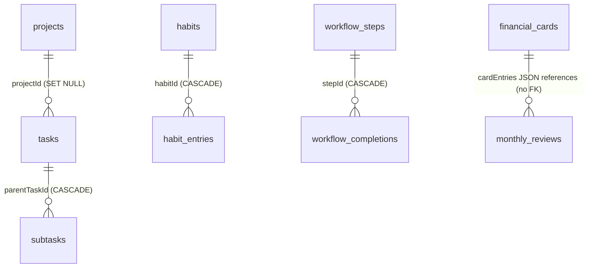

# DayFrame — Data Model

Owner: `df-lead` · Last updated: 2026-09-20 (v1.1 — every column re-checked against `server/db.js` CREATE blocks **and** ALTER migrations, plus the live DB)

SQLite, one file: `data/app.db` (gitignored). Schema is created in `server/db.js`; later columns arrive through **idempotent add-only migrations** (`try { db.exec('ALTER TABLE … ADD COLUMN …') } catch {}`). No ORM — `better-sqlite3` prepared statements inside `server/routes/*.js`.

Connection pragmas (`server/db.js:11-12`): `journal_mode = WAL`, `foreign_keys = ON`. **Foreign keys are actually enforced** — that is what nulls `tasks.projectId` when a project is deleted (`ON DELETE SET NULL`, `server/db.js:39`) and cascades `subtasks` / `habit_entries` / `workflow_completions`.

## 1. Tables (16 in `server/db.js`)

### projects
`id` PK · `name` · `color` (default `#3788d8`) · `createdAt`

### tasks
`id` PK · `title` · `description` · `descriptionImages` JSON `'[]'` · `dueDate` · `priority` (`low|medium|high`, default `medium`) · `status` (`pending|completed`, default `pending`) · `projectId` → projects(id) ON DELETE SET NULL · `assignedTo` JSON `'[]'` (team member ids) · `isRecurring` 0/1 · `recurrencePattern` JSON **object** (nullable) · `statusOverrides` JSON `'{}'` · `statusFromOverrides` JSON `'[]'` · `createdAt` · `updatedAt`
Migrated in: `estimatedMinutes` · `sortOrder` (default 0) · `startTime` · `endTime` · `scheduledTime` (`server/db.js:213-241`)
> `recurrencePattern` must persist as a JSON **object** (`{"type":"weekly","daysOfWeek":[0],"interval":1}`). Stored as a string it breaks rendering (the frontend reads `.daysOfWeek`). Pattern keys the code actually consumes: `type`, `interval`, `daysOfWeek` (0=Sun), `dayOfMonth`, `weekOfMonth`/`dayOfWeek`/`hour`/`minute` (the "last Saturday" monthly form), `endDate`, `endAfterOccurrences` (`src/utils/recurrence.js:41-51, 145-201`). The base `dueDate` must fall on a day the pattern produces; `generateRecurringTasks` fast-forwards from `dueDate` and caps at 500 instances (`:109-120`).
> **Trap — `status` is not always `pending|completed` at rest.** The DDL default is `'pending'`, but `POST /api/tasks` writes `status: b.status || 'todo'` (`server/routes/tasks.js:49`), so a task created without a `status` sits in the DB as `'todo'`. The only thing that repairs it is the boot-time normalisation `UPDATE tasks SET status='pending' WHERE status IN ('todo','in-progress')` (`server/db.js:207-210`) — i.e. the value is normalised at the *next server restart*, not on write. The UI always sends a status, so this only bites scripts and cron callers. Live check 2026-09-20: 381 task rows, values are only `completed` (370) and `pending` (11).

### team_members
`id` PK · `name` · `email` · `role` · `createdAt`

### subtasks
`id` PK · `parentTaskId` → tasks(id) ON DELETE CASCADE · `title` · `completed` 0/1 · `sortOrder` · `createdAt` · `updatedAt`

### habits
`id` PK · `name` · `description` · `color` (default `#10B981`) · `frequency` JSON (`{"type":"daily"}`) · `isArchived` 0/1 · `sortOrder` · `createdAt`

### habit_entries
`id` PK · `habitId` → habits(id) ON DELETE CASCADE · `date` · `timeSpentSeconds` (default 0) · `createdAt` · **`UNIQUE(habitId, date)`**
> One entry per habit per day. A second POST for the same day returns **HTTP 409** `{"error":"Entry already exists for this habit and date"}` **without updating** (`server/routes/habitEntries.js:43-48`) — the correct write path is GET → DELETE (`/by-date?habitId=&date=`) → POST, or PUT the existing entry id.
> There is **no `count` column** (see §6 — count tracking is inert).

### weekly_objectives
`id` PK · `weekStart` · `objectives` JSON `'[]'` · `createdAt` · `updatedAt` · `UNIQUE(weekStart)`
> `objectives` is an array of `{text, completed}` — a legacy array-of-strings row is rewritten on boot by the data migration in `server/db.js:186-204`. Written by two clients: the planner panel (`WeeklyObjectives.jsx:239`) and the weekly review's "Write weekly goals to DayFrame" bridge, which **replaces** the planner's objectives (`WeeklyReview.jsx:512-528`).
> A `mode` column (`personal|work`) + `UNIQUE(weekStart, mode)` exists on the WORK-toggle branch — and **in the live DB** — but not in master's code (see §5 and DECISION_LOG ADR-009/ADR-010).

### weekly_reviews
`id` PK · `weekStart` · `cleanupTasks` JSON `'[]'` · `gratitudeEntries` JSON `'[]'` · `reflectionAnswers` JSON `'{}'` · `weeklyGoals` JSON `'[]'` · `syncFlags` JSON `'{}'` · `createdAt` · `updatedAt` · `UNIQUE(weekStart)`
> `syncFlags` carries `goalsSynced` / `goalsSyncedAt` / `keyEventsListed` (`WeeklyReview.jsx:803-827`). No DELETE endpoint.

### daily_notes
`id` PK · `date` · `highlights` · `rolledOverTaskIds` JSON `'[]'` · `createdAt` · `updatedAt` · `UNIQUE(date)`

### yearly_goals
`id` PK · `year` · `goals` **JSON array `[{text, completed}]`** · `images` JSON `'[]'` (base64 data URLs) · `createdAt` · `updatedAt` · `UNIQUE(year)`
Migrated in: `images` (`server/db.js:243-247`) · `vision` free text (`:255-260`)
> Corrected: `goals` is **not** rich text. It held a free-text string until `de928b5` (2026-03-18, "restructure YearlyGoals into vision textarea + goals checklist"); the migration in `server/db.js:262-281` moves any non-JSON-array `goals` value into `vision` and resets `goals` to `'[]'`. Today: `vision` = long-form text, `goals` = checklist of `{text, completed}` (`src/components/YearlyGoals.jsx:10, 90`).
> Gotcha: the **not-found default** returned by `GET /api/yearly-goals` hands back `goals`/`images` as *strings* (`'[]'`), while a persisted row returns the raw TEXT columns — the client `JSON.parse`s them itself (`yearlyGoals.js:18`, `YearlyGoals.jsx:29`).

### key_events
`id` PK · `title` · `date` · `description` · `category` · `createdAt` · `updatedAt` (rendered in the review tab's key-events grid **and** the planner's `WeeklyObjectives` grid; rendered twice with two independent UIs)

### workflow_steps / workflow_completions
`workflow_steps`: `id` · `text` · `sortOrder` · `createdAt`
`workflow_completions`: `id` · `stepId` → workflow_steps(id) ON DELETE CASCADE · `date` · `createdAt` · `UNIQUE(stepId, date)`
> `POST` on an existing `(stepId, date)` is treated as **success** (returns the existing row, HTTP 200) rather than a conflict — the opposite of `habit_entries` (`server/routes/workflowCompletions.js:25-29`).

### financial_cards
`id` PK · `name` · `institution` · `cardType` (default `credit`) · `accountNumber` · `displayOrder` · `active` 0/1 · `createdAt` · `updatedAt`
> **Seeded from a gitignored file — never from tracked source.** The first `GET /api/financial-cards` on an empty table seeds from the optional `data/seed-cards.json` (a JSON array of `{name, institution, cardType, accountNumber}`), read at request time by `readSeedCards()` (`server/routes/financialCards.js:15-30`). **If the file is absent, unreadable or not a JSON array, nothing is seeded** and the GET still returns `200` with `[]`; there is no fallback list in source (POL-006 — the GitHub repo is public). Once the table holds at least one row the file is never read again, so this is a **no-op for the live DB**, which is already seeded. Deactivate is a soft delete (`active = 0`); there is no DELETE route.

### monthly_reviews
`id` PK · `monthKey` (`YYYY-MM`) · `year` · `month` · `reviewDate` · `status` (`pending|in_progress|completed`) · `checklist` JSON `'[]'` · `cardEntries` JSON `'[]'` (per-card payment entries) · `notes` · `images` JSON `'[]'` (base64 photos, Phase 1 paste UI) · `completedAt` · `createdAt` · `updatedAt` · **`UNIQUE(monthKey)`**
Migrated in: `images` (`server/db.js:249-253`) · `notes` (`:283-287`)
> `checklist` items are `{id, key, text, section, order, completed, completedAt}` seeded from the 20-item template in `src/utils/checklistTemplate.js:11-57`; item ids use `crypto.randomUUID`, so they are stable per review but not across reviews. `cardEntries` items are `{cardId, cardName, cardInstitution, accountNumber, statementSaved, amount, dueDate, moneyProVerified, ppsSetUp, moneyProRecorded, notes}` and the PATCH allow-list is exactly those last 7 fields (`monthlyReviews.js:220`).
> `images` is stripped from `GET /api/monthly-reviews` (list) and carried only by `/current` and `/by-month`; `PATCH /:id/images` is the write path. `persistReview()` never touches `images`. Any month that is not the current month is read-only in the UI.

### settings
`key` PK · `value` (TEXT, JSON-encoded) · `updatedAt`
> Generic key/value store for app-level state. Only one key is in use today: `todayOrder` — the per-day task ordering array (`App.jsx:53, 205`; value seen live: `["400","378","374"]`). New app-level state should prefer this table over new tables when it is not relational.

## 2. Data migrations (not just column adds)

`server/db.js` runs **three** data rewrites at boot, in addition to the ALTERs. They are the reason a legacy DB keeps working — and they mean booting the server can mutate Anderson's rows:

| Migration | Location | Effect |
|---|---|---|
| `weekly_objectives.objectives`: array of strings → array of `{text, completed}` | `server/db.js:186-204` | rewrites rows whose first element is a string |
| `tasks.status`: `todo` / `in-progress` → `pending` | `server/db.js:207-210` | unconditional `UPDATE` on every boot |
| `yearly_goals`: free-text `goals` → `vision`, `goals` := `'[]'` | `server/db.js:262-281` | one-way; re-running is a no-op because `goals` is then a JSON array |

## 3. Requested entities that do NOT exist (gap note)

The team mandate listed "Workspaces, Projects, Activity Logs, Users". Reality in the schema:

| Requested | Actual | Note |
|---|---|---|
| Projects | `projects` | exists ✅ |
| Workspaces | *none* | DayFrame is single-user and single-DB; there is no workspace/tenant concept. Do not invent one without an owner decision. |
| Activity Logs | *none* | No audit trail table. `createdAt`/`updatedAt` timestamps are the only history. Adding an audit log is a product decision, not a refactor. |
| Users | `team_members` + `settings` | `team_members` is a lightweight assignee directory for tasks — **not** authentication or authorization. |

## 4. Migration policy (binding)

1. **Add-only and idempotent.** Every schema change is `ALTER TABLE … ADD COLUMN x … DEFAULT …` wrapped in `try/catch`; never `DROP`/recreate a table that holds Anderson's data.
2. **Default values required** for new columns so existing rows stay valid (`'[]'`, `'{}'`, `0`, `NULL`).
3. **UNIQUE constraints** cannot be added by ALTER — introducing one that already exists in `CREATE` requires a **table rebuild** that copies rows (this is what the parked WORK-toggle work did for `weekly_reviews` / `weekly_objectives`; the rebuilt DDL is in §5). A rebuild migration must (a) run once behind a column/shape check, (b) copy every row, (c) be rehearsed against a copy of `data/app.db` before it touches the live file.
4. **Data rewrites go in the same guarded style** as §2 and must be idempotent.
5. Verify with a real DB copy: boot a server against a legacy-shaped snapshot and confirm rows survive.

## 5. The live DB is ahead of the code (schema drift — read this before writing migrations)

`CREATE TABLE IF NOT EXISTS` never re-shapes an existing table, so the running `data/app.db` and a fresh clone's schema are **not** the same. Checked on 2026-09-20 with `sqlite3 data/app.db`:

- **17 tables, not 16**: the 16 above plus `google_calendar_tokens` (`id, accessToken, refreshToken, expiryDate, createdAt, updatedAt`). Nothing in this repo creates it — no `CREATE` in `server/`, no reference anywhere in `src/` or `server/` (grep: only `data/app.db` itself matches). It is an orphan left by an out-of-repo script; do not build on it without tracing its writer first.
- `weekly_reviews` and `weekly_objectives` **do have** `mode TEXT NOT NULL DEFAULT 'personal'`, `UNIQUE(weekStart, mode)` and `CHECK(mode IN ('personal','work'))` in the live DB — the WORK-toggle shape (ADR-009) — while master's `server/db.js` still declares `UNIQUE(weekStart)`. Because the tables already exist, master's `CREATE` is a no-op and the live columns survive.
- Consequence for planning: a card that says "the column does not exist" must say **where** it checked. Against the live DB, `mode` exists; against master's code, it does not. Both statements are true and neither is sufficient alone.

## 6. Known data defect — habit count tracking is inert

The `habit-count-tracking` change (`fdc8e05`, archived under `openspec/changes/archive/2026-07-12-habit-count-tracking/`) added per-habit **count** tracking ("Push-ups 30 reps" instead of minutes) — but it **touched zero files under `server/`** (`git show --stat fdc8e05`: 18 files, all `openspec/`, `src/`). Verified against both the live DB and the routes:

- `habits` has **no `trackType` column**, and `POST`/`PUT /api/habits` never read that field (`server/routes/habits.js:36-46, 60-70`) — so a habit saved as "Repetitions" comes back as a duration habit and `getTrackType()` (`src/utils/habits.js:268-270`) always returns `'duration'`.
- `habit_entries` has **no `count` column**, and `POST`/`PUT /api/habit-entries` only read `timeSpentSeconds` (`server/routes/habitEntries.js:32, 40, 56`) — while the UI sends `count` (`src/components/HabitTracker.jsx:89, 112-120`, `src/components/PlannerHabitsPanel.jsx:66-80`). The reps are silently discarded; the entry is stored with `timeSpentSeconds = 0`.
- Live check: `select coalesce(trackType,'<NULL>') … from habits` and the same for `habit_entries.count` both fail with `no such column`.

So `entry.count` readers (`getEntryValue`, `HabitHeatmap`, `HabitTracker`, `WeeklyReview` habit chips) read `undefined`. Fixing it needs a schema migration (§4.3 for the rebuild-free path: two ALTERs), route field plumbing, and a verify script — tracked as an open item in `DECISION_LOG.md`, not fixed here.

## 7. How to update this document

Rule B: update this file in the same branch as any change that adds or alters a table, column, constraint or JSON blob shape. Cite the migration line in `server/db.js`. If you changed the live DB by hand or by an out-of-repo script, say so in §5.
